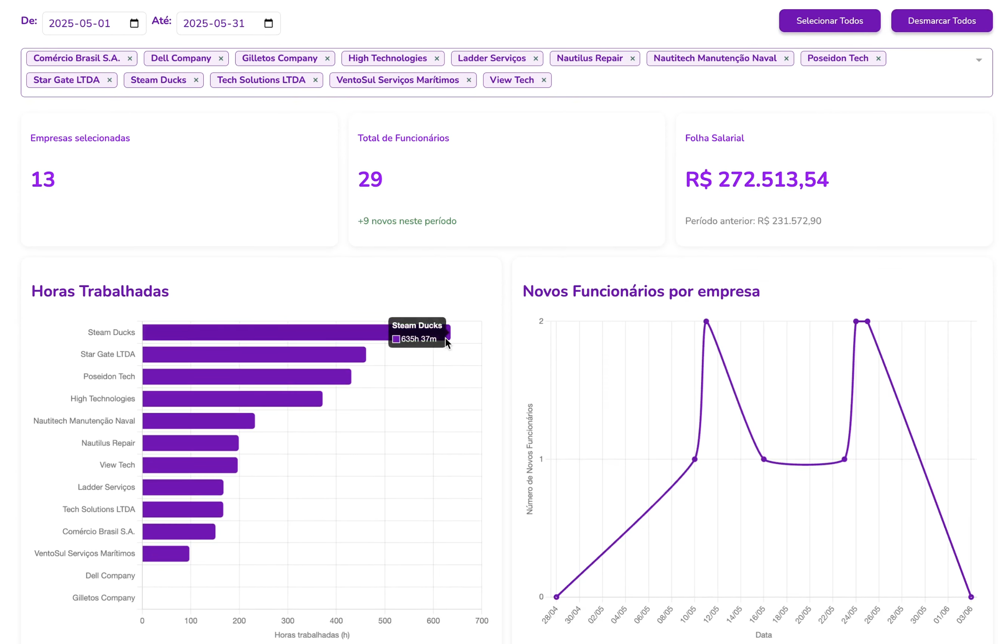

# Lucas Heck Acosta

## Introdução

Tecnólogo em Análise e Desenvolvimento de Sistemas pelo Seneca College (Toronto) e em Banco de Dados pela FATEC São José dos Campos. Possuo experiência profissional como desenvolvedor, atuando em automação de processos com Python e integrações entre sistemas utilizando SAP CPI.

Tenho experiência no design de arquitetura, implementação, testes e documentação de automações corporativas de grande escala, com foco em ambientes de alto volume de dados. Me interesso especialmente por segurança da informação, além de automação e otimização de processos como forma de aumentar a eficiência e confiabilidade dos sistemas.

## Contatos
* [GIT](https://github.com/Lucas-heck-acosta)
* [LinkedIn](https://www.linkedin.com/in/lucas-h-acosta/)

## Meus Principais Conhecimentos
Possuo domínio em:

- Programação em Python para automação de processos e manipulação de dados.
- Integração de sistemas com SAP CPI, incluindo design e implementação de fluxos complexos.
- Banco de Dados Relacionais (MySQL, PostgreSQL) com foco em modelagem, consultas SQL e otimização de desempenho.
- Versionamento de código com Git e GitHub.
- Desenvolvimento de scripts e APIs para comunicação entre sistemas corporativos.

Tenho interesse em aprofundar meus conhecimentos em:

- Segurança da Informação aplicada a integrações e proteção de dados sensíveis.
- Arquitetura de Sistemas voltada para escalabilidade e alta disponibilidade.
- Cloud Computing (AWS, Azure) para soluções de integração em nuvem.
- Machine Learning 

## Meus Projetos

### Em 2025-1

O Projeto **Pontual** foi desenvolvido pela equipe **STEAM DUCKS** com o objetivo de entregar uma aplicação web robusta para cadastrar, editar e organizar dados de empresas, colaboradores e seus registros de ponto (entradas e saídas). Além disso, o sistema fornece funcionalidades de gestão e visualização por meio de dashboards interativos e relatórios, facilitando o acompanhamento e a análise das informações.

A empresa parceira foi a **Altave**, que apresentou a necessidade de uma solução tecnológica para lidar com o armazenamento e gerenciamento dos registros de entrada e saída de funcionários. O desafio estava em centralizar essas informações, garantindo maior segurança, confiabilidade e eficiência na gestão dos dados.

[REPOSITÓRIO](https://github.com/Steam-Ducks/point-system)

#### Tecnologias Utilizadas
- **Java** → Linguagem principal utilizada para construir a lógica do backend do sistema e implementar as regras de negócio.  
- **Spring Boot** → Framework que facilitou a criação da API backend, garantindo rapidez no desenvolvimento e integração entre os módulos.  
- **PostgreSQL** → Banco de dados relacional escolhido para armazenar com segurança os registros de ponto, dados de empresas e funcionários.  
- **Supabase** → Suporte adicional ao banco de dados, oferecendo autenticação e serviços em nuvem que facilitaram o gerenciamento da aplicação.  
- **Vue.js** → Framework JavaScript usado no front-end para criar uma interface moderna, dinâmica e intuitiva para os usuários.  
- **Figma** → Utilizado na etapa de design para prototipagem e validação das telas.  
- **Git** → Ferramenta de controle de versão e colaboração em equipe, mantendo o histórico de alterações do código.  
- **GitHub** → Plataforma onde o repositório do projeto foi hospedado.

#### Contribuições Pessoais

- **Autenticação JWT**

    **Objetivo:** Garantir acesso seguro à aplicação por meio de autenticação stateless com **JSON Web Tokens (JWT)**, protegendo rotas e dados sensíveis e oferecendo uma experiência fluida (login, refresh de sessão, logout).
    - **Backend** (Java + Spring boot / Spring Security)
  
        Implementei toda a camada de autenticação e autorização utilizando um fluxo baseado em JWT. O **JwtAuthenticationFilter** foi configurado para liberar apenas os endpoints públicos de autenticação (/api/auth/) e a documentação Swagger, enquanto todo o restante da API permanece protegido. A classe JwtUtil atua como componente central para manipulação dos tokens, oferecendo geração de access tokens com claims personalizadas (como isAdmin), criação de refresh tokens para renovação segura da sessão, validação de integridade e expiração, além da extração de informações do usuário (e-mail, username). O AuthController concentra os endpoints de autenticação (/register e /login), delegando ao AuthenticationService o processamento das requisições e retornando respostas padronizadas, com tratamento apropriado de exceções. Durante o ciclo de requisições, o filtro de autenticação intercepta chamadas, extrai o token JWT do header Authorization, valida seus dados e carrega automaticamente o contexto de segurança, garantindo que apenas usuários autenticados tenham acesso aos recursos protegidos.
    - **FrontEnd** (Vue.js + Router)
  
        modelei a camada de autenticação utilizando Vue.js 3 em conjunto com o Vue Router, garantindo que a experiência do usuário fosse alinhada com as regras de segurança definidas no backend. O UserService centraliza toda a comunicação com a API de autenticação, oferecendo métodos padronizados para login, registro de usuários e validação de sessão. O token JWT e demais informações do usuário são armazenados de forma persistente no Local Storage, sendo automaticamente injetados nas chamadas subsequentes à API. Além disso, o sistema de rotas foi configurado com navigation guards, que verificam a validade do token antes de cada transição, bloqueando acessos não autorizados e redirecionando para a tela de login. Para melhorar a experiência, o histórico da navegação é preservado, permitindo que, após a autenticação, o usuário seja redirecionado para a página originalmente requisitada.

- **Dashboard**

    **Objetivo:** Compilar os dados de maneira clara, centralizada e acessível, oferecendo uma visão consolidada das informações mais relevantes para o usuário. A Dashboard foi projetada para atuar como ponto inicial de navegação do sistema, reunindo métricas, gráficos e indicadores que refletem o estado atual do projeto e auxiliam na tomada de decisão.

    - **Backend** (Java + Spring Boot)
        
        Desenvolvi endpoints específicos voltados à agregação de dados, já aplicando filtros e cálculos em tempo real. Isso garante que a camada de visualização receba informações consistentes e otimizadas, mesmo em cenários com grande volume de registros.

        O DashboardController centraliza essa lógica no endpoint /api/dashboard, que processa requisições com parâmetros de período (startDate e endDate) e retorna métricas consolidadas de todas as empresas do sistema.

        Para lidar com alta demanda e grandes bases, implementei processamento paralelo usando CompletableFuture em conjunto com ExecutorService. Isso permite que o CompanyService calcule simultaneamente os resultados de múltiplas empresas, reduzindo significativamente o tempo de resposta.
    - **Frontend** (Vue.js + Chart.js + ApexCharts)

        Desenvolvi a interface da Dashboard utilizando Vue.js 3 com foco em responsividade e interatividade. O DashboardService faz apenas uma chamada de API (a cada mudança de data), enviando parâmetros de período (startDate e endDate) para filtrar dados de forma dinâmica. A camada visual foi construída com componentes modulares (cards) que renderizam diferentes tipos de métricas: cartões informativos para dados consolidados (total de funcionários, empresas ativas, folha salarial), gráficos interativos usando Chart.js e ApexCharts para visualização de tendências temporais e distribuições. Implementei sistema de atualização automática dos dados, com loading states e tratamento de erros para garantir uma experiência fluida. O layout responsivo garante visualização otimizada em diferentes dispositivos, enquanto filtros de período permitem análises customizadas.

    
#### Hard Skills
Apresente as hard skills que você utilizou/desenvolveu durante o projeto e o nível de proficiência alcançado. Exemplo: CSS - Sei fazer com autonomia

#### Soft Skills
Apresente as soft skills que você utilizou/desenvolveu durante o projeto e em quais situações elas foram fundamentais. Exemplo: Comunicação - Precisei exercitar minhas habilidades de comunicação para viabilizar as reuniões semanais levando em conta as disponibilidades dos membros, que não cursavam as mesmas disciplinas.

